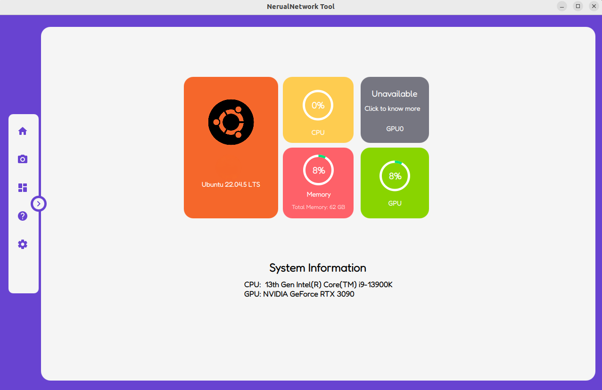
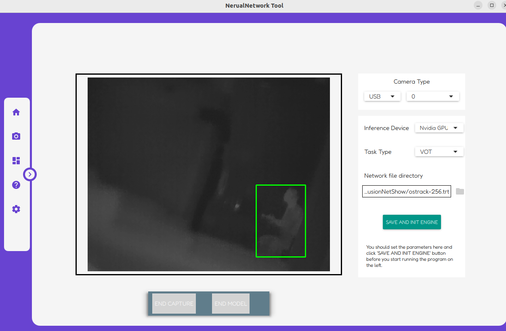

# RTDETR + ByteTrack + QT 
---
**项目仅做参考，部分功能未完成**

文件目录说明：
```
Your_dir
    ├── assets              ------ 资源目录，存放图片，字体文件等
    ├── bin                 ------ 默认可执行文件生成目录
    ├── build
    ├── iconwin             ------ 图标
    ├── include             ------ 头文件目录
    ├── lib                 ------ 存放生成的动态链接库
    ├── qml                 ------ qml界面文件目录
    ├── src                 ------ 源文件目录
    ├── qml.qrc             ------ qml的资源文件，里面存放了`.qml`文件路径信息， 资源文件路径信息，qml主题文件路径信息，是编译所需的源文件
    ├── bytetrack           ------ bytetrack部分
    └─tensorRT_Pro_Model    ------ TensorRT_Pro部分

qml
    ├── CalibratePage.qml   ------ 未完成
    ├── CircleProgress.qml  ------ HomePage组件，显示资源利用率
    ├── CustomDialog.qml    ------ 未完成
    ├── DemoPage.qml        ------ 视频流显示， 推理结果显示
    ├── HomePage.qml        ------ memory, cpu and gpu 资源利用率显示
    ├── InfoPage.qml        ------ 未完成
    ├── main.qml
    └── SettingPage.qml     ------ 未完成

include/src
    ├── app_rtdetr          ------ 管理RTDETR与ByteTrack节点
    ├── imageprocess        ------ 相机视频流读取，调用推理入口函数
    ├── main.cpp            ------ 将类暴露给qml
    ├── ocvimageprovider    ------ QImage 与 cv::Mat 格式转换
    ├── statusmonitor       ------ info of memory, cpu and gpu
    ├── threadcontroller    ------ 管理线程，定义大部分connect()
    └── utility             ------ 包含模型基本的运行状态
```

## 编译方式
本项目推荐 Vscode + CMake;  
原项目建议采用 Qt Creator + CMake 构建系统构建。


本机环境说明：
||||
|----|----|----|
|类别|版本|备注|
|OS|Ubuntu 22.04 LTS| GPU: Nvidia GTX 3090|
|Qt|5.15.3|Qt Creator 6.0.2|
|OpenCV|4.9.0|3.x到4.x需更改部分代码（将`bin`添加至环境变量中）|
|Nvidia CUDA|11.5|建议在CMakeLists中指定路径|
|Nvidia cuDNN|8.8.1.3|建议在CMakeLists中指定路径|
|Nvidia TensorRT|8.6.1.6|建议在CMakeLists中指定路径|
|Protobuf|3.11.4|Tensor_Pro项目需要特定版本


**Nvidia CUDA/cuDNN/TensorRT 仅支持Nvidia自家GPU**，如需编译请访问[Nvidia Developer](https://developer.nvidia.com/)下载所需套件。


## 运行方式
+ 需要生成TensorRT的 .trt 文件, 可参考[Blog](https://blog.csdn.net/qq_40672115/article/details/134356250)
+ 编译  
  + cd build
  + cmake ..
  + make
+ 在根目录下 ./bin/NetWorkShow 按照正确的顺序选择摄像头序列，推理任务类别和模型位置，先点击`Save and Init Engine`初始化引擎，然后可以点击左边的`Start Capture`和`Start Model`

## 运行截图

+ Home page


+ Detect page



## 参考资源
+ [YoloV5RGBD](https://github.com/parker-int64/yolov5-RGBD)
+ [tensorRT_Pro](https://github.com/shouxieai/tensorRT_Pro)
+ [tensorRT_Pro_YOLOV8](https://github.com/Melody-Zhou/tensorRT_Pro-YOLOv8)
+ [ByteTrack](https://github.com/ifzhang/ByteTrack)

